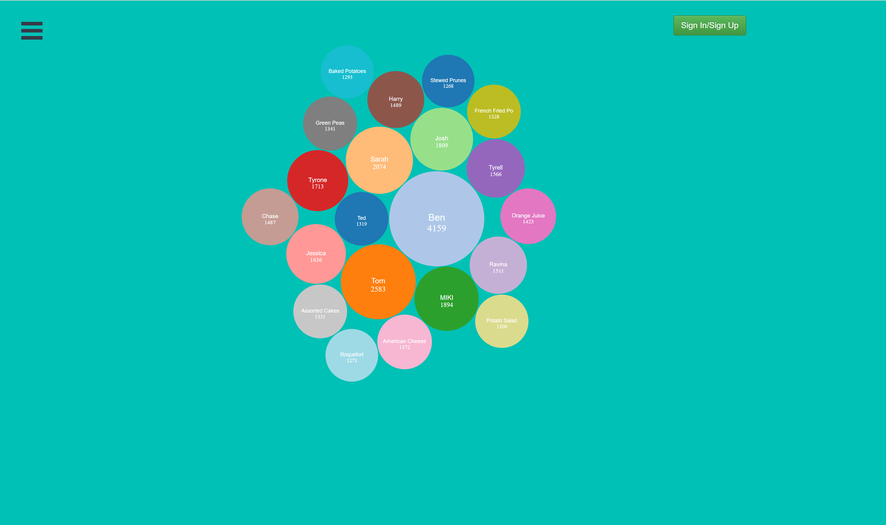

# ChaseInPositivity
Project to increase retention for the "Be Positive" non-profit Organization.
## Technologies used :
+ [Node.js](https://nodejs.org/)
+ [D3.js library](https://d3js.org/)
+ [React](https://reactjs.org/)
+ [PostgreSQL](https://www.postgresql.org/)
+ [Postman](https://www.getpostman.com/)
+ [Amazon Web Services](https://aws.amazon.com/)
+ [Bootstrap](http://getbootstrap.com/)

### Instructions
- Install Node
- Make sure your own the latest Node and npm versions using the commands `node -v` and `npm -v` to check your current version.
- Navigate to the **/react-modal-login** folder within the project inside your terminal then proceed with the following commands:

```
 npm install
 npm start
 ```


 ### Inspiration for the Project

  Our inspiration for this assignment came from the non-profit B+ (Be Positive). B+ is a non-profit tackling childhood cancer. Most of their hard work is focused on High School students but they have a hard time with retention as the student later graduate and move onto other things, inevitably forgetting about the non-profit. My team and I create a gamified aspect to the overall donation process where each user can see how much each of their friends donated to encourage competition in the donation stage. We also made it easier for the administrators to see where their various streams of revenue are coming from and how they can better concentrate their efforts to target specific regions that are willing to donate more.


### Our Frontend
The Node.js framework was used to install the React.js library. React and Bootstrap were our frontend tools, such as the navigation bar and header buttons. The D3 library used was our data visualization tool to create dynamic bubbles that would adjust accordingly based off of the data input.




### Display
The user is given the choice of logging in or registering for an account, with the ability to link to your social media accounts such as Facebook and Twitter. After logging in, the user is presented with a screen displaying multiple bubbles. Each bubble represents one friend that is a donor from their social circle. The user can have multiple social circles, a social circle for each social category. The point of the social circle is to see other friends donating and encourage donor competition. The administrators will also have their own displaying, showing more data and allowing for more in depth searches.


### Our Backend
Postgres was picked as our relational database because of the need to have unique identifiers for our project and ease of scalability. Our database was hosted on an Amazon Web Server and we used Postman to make requests, tests, and used for debugging
